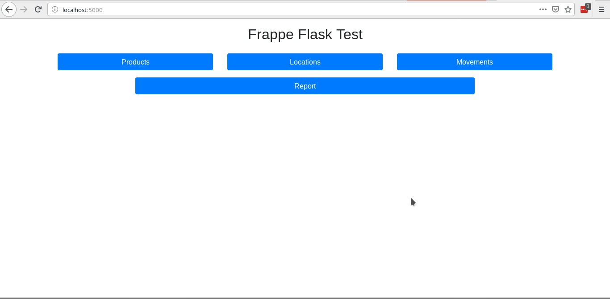
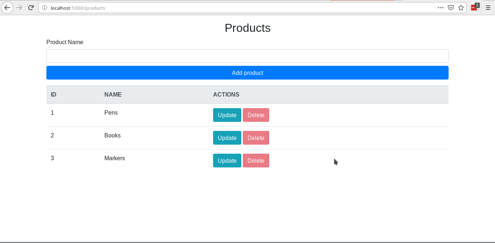
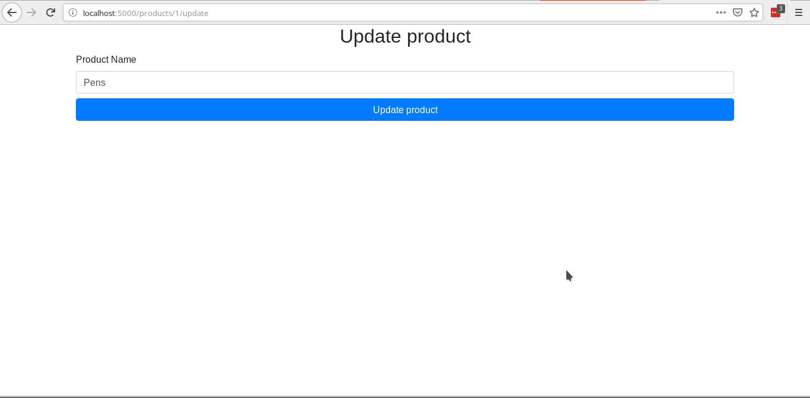
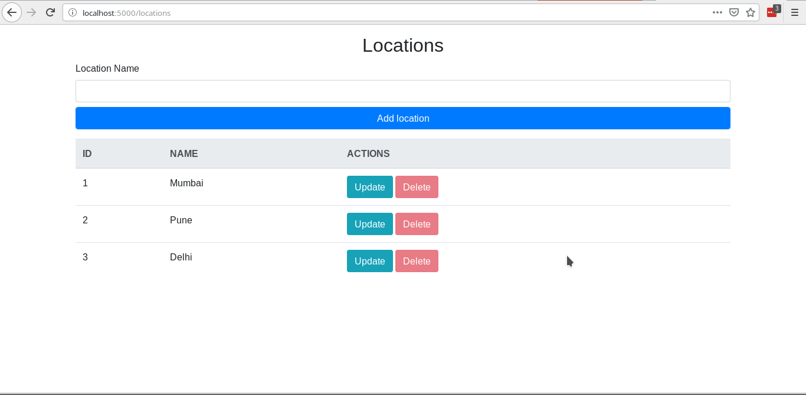
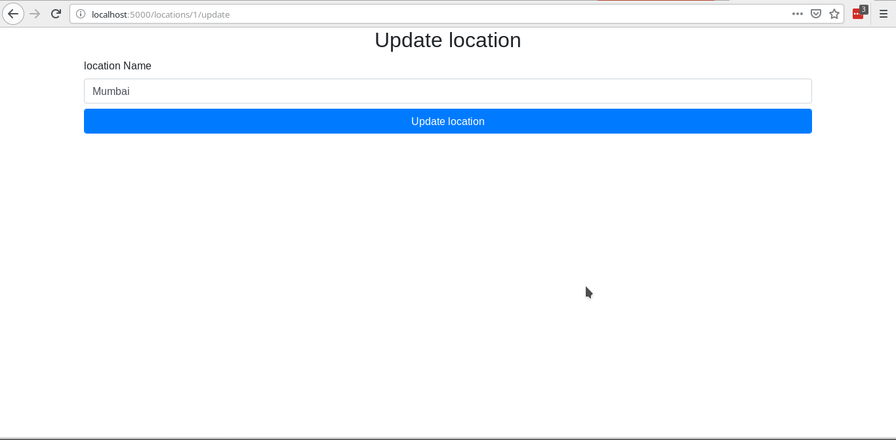
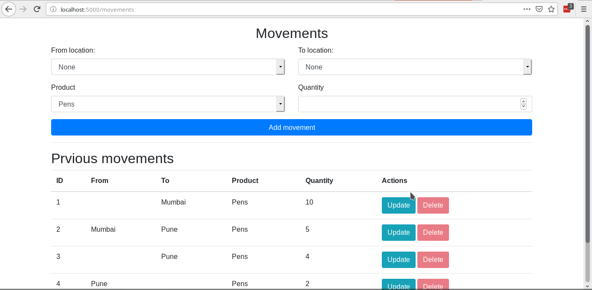
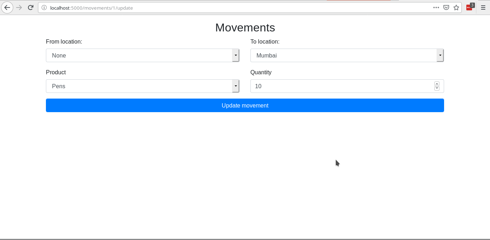
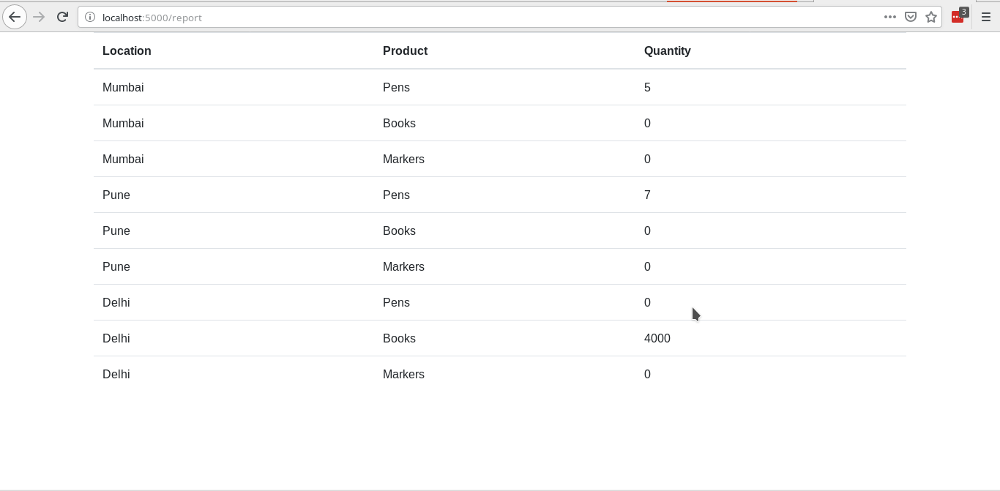

# Inventory management web application

Based on the specifications, as gived [here](https://frappe.io/flask-test)
Below are screenshots of the application

## Index

## Products

## Update product

## Locations

## Update location

## Movements

## Update movement

## Report

